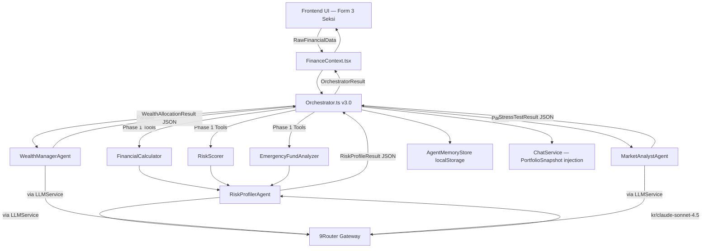
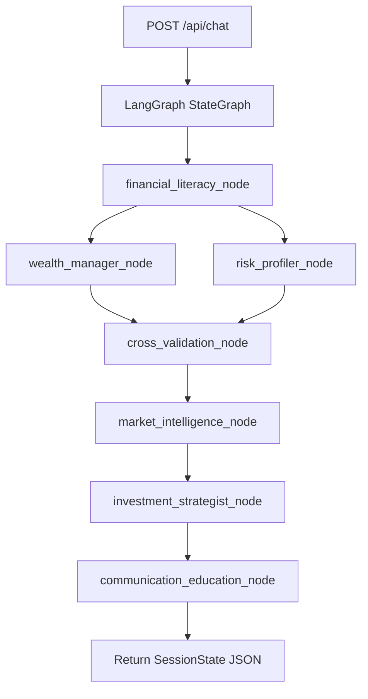

# FinanceIQ: Multi-Agent LLM Integration Blueprint

Dokumen ini disusun untuk tim *Backend/AI Engineer* yang ingin memahami arsitektur integrasi LLM dan melanjutkan pengembangannya. **Penting:** sejak dokumen ini pertama dibuat, arsitektur telah berkembang signifikan — frontend sudah memiliki LLM integration aktif.

---

## Status Integrasi LLM Saat Ini

| Lapisan | Status | Detail |
|---|---|---|
| Frontend Agents (3 agen) | ✅ **LLM Aktif** | `LLMService.ts` → 9Router → claude/deepseek |
| Frontend Chatbot | ✅ **LLM Aktif** | `ChatService.ts` → LLMService → respons live |
| Frontend Fallback | ✅ **Aktif** | Rule-based otomatis jika LLM gagal |
| Backend Agents (7 agen) | ⚠️ **Perlu API Key** | LangGraph siap, butuh 9Router/provider aktif |
| Frontend ↔ Backend Wiring | ❌ **Belum** | FE masih pakai agen lokal, bukan `/api/chat` |

---

## 1. Topologi Arsitektur (Agent Workflow)

### Frontend Pipeline (Aktif)



### Backend Pipeline (Siap, Perlu Aktivasi)



---

## 2. Penjelasan Flow Frontend (Detail)

1. User mengisi form 3 seksi di halaman Beranda.
2. `FinanceContext.tsx` memanggil `runAgentPipeline()` yang menginisiasi `Orchestrator.ts`.
3. **PHASE 0 — PLANNING:** `buildAgentPlan()` mencatat 6 langkah eksekusi.
4. **PHASE 1 — TOOLS:** 3 alat deterministik menghasilkan angka pra-kalkulasi sebelum LLM.
5. **PHASE 2 — AGENT 1 (Risk Profiler):**
   - `callAgentLLM()` dikirim ke 9Router dengan system prompt + data keuangan user.
   - LLM menghasilkan JSON `RiskProfileResult`.
   - Jika LLM gagal, fallback rule-based berjalan otomatis.
6. **PHASE 3 — AGENT 2 & 3 (Parallel):**
   - `WealthManagerAgent` + `MarketAnalystAgent` berjalan bersamaan via `Promise.all()`.
   - Masing-masing memanggil LLM dengan konteks dari Agent 1.
   - WealthManager juga merekomendasikan instrumen spesifik (nama RDPU, seri SBN, dll.).
7. **PHASE 4 — MEMORY:**
   - `AgentMemoryStore.saveAnalysis()` — simpan semua hasil ke localStorage.
   - `ChatService.setPortfolioSnapshot()` — inject data langsung ke chatbot agar siap menjawab tanpa tanya ulang.

---

## 3. Di Mana Anda Harus Menulis Kode

Semua logika LLM terpusat di folder:
```
frontend/src/services/agents/
```

### A. `LLMService.ts` — Gateway Utama
**Konfigurasi API key dan URL** ada di 2 baris pertama file ini.
Fungsi utama: `callAgentLLM(systemPrompt, userPrompt, numModelsToTry, parseJson)`.

**Untuk mengganti provider:** cukup ubah `API_URL`, `API_KEY`, dan array `MODELS`.

### B. `RiskProfilerAgent.ts`
- **Goal:** Analisis profil risiko + koreksi bias persepsi (jika user pilih Agresif tapi kondisi keuangan tidak mendukung).
- **LLM Prompt:** System prompt profiler + data keuangan mentah.
- **Expected Output:** JSON `RiskProfileResult` dengan `surplus`, `dtiRatio`, `correctedRisk`, `explanation`.
- **Fallback:** Kalkulasi rule-based deterministik.

### C. `WealthManagerAgent.ts`
- **Goal:** Alokasi portofolio + rekomendasi instrumen spesifik + proyeksi compounding 10 tahun.
- **LLM Prompt:** Konteks Agent 1 + data pasar dari `MarketDataService`.
- **Expected Output:** JSON `WealthAllocationResult` dengan `allocations`, `projections`, `recommendedInstruments`, `message`.
- **Fallback:** Alokasi deterministik berdasarkan `correctedRisk`.

### D. `MarketAnalystAgent.ts`
- **Goal:** Stress test 3 skenario krisis: market crash -50%, hiperinflasi 15%, kehilangan pekerjaan.
- **LLM Prompt:** Konteks Agent 1 + skenario krisis.
- **Expected Output:** JSON `StressTestResult` dengan narasi `marketCrashImpact`, `hyperinflationImpact`, `jobLossImpact`.
- **Fallback:** Kalkulasi survival months + narasi statis.

### E. `ChatService.ts` — Literacy Agent
- **Goal:** Menjawab pertanyaan user dengan konteks penuh hasil analisis.
- **System Prompt:** Dibangun dari `PortfolioSnapshot` — mencakup data input + hasil ketiga agen.
- **Limit:** 5 pesan gratis per sesi (`sessionStorage`).

---

## 4. Struktur Tipe (Schema) Wajib

Semua agen harus menghasilkan output sesuai interface di `types.ts`.

**Untuk agen frontend (LLM), pastikan selalu lakukan type-safe parsing:**
```typescript
// Contoh safe parsing setelah terima respons LLM:
const parsed = await callAgentLLM(systemPrompt, userPrompt);

const result: RiskProfileResult = {
  surplus: Number(parsed?.surplus) || 0,
  dtiRatio: Number(parsed?.dtiRatio) || 0,
  correctedRisk: parsed?.correctedRisk || 'MODERAT',
  // ... selalu berikan fallback value
};
```

**Rekomendasi untuk meningkatkan reliabilitas:**
- Gunakan `response_format: { type: "json_object" }` di API call (sudah didukung OpenAI, Groq, OpenRouter).
- Atau gunakan Function Calling / Structured Outputs (`json_schema`) untuk jaminan 100%.
- Selalu `Number(json.field) || 0` untuk field numerik.
- Selalu berikan fallback string untuk field teks.

---

## 5. Roadmap Pengembangan Lanjut

### Tingkat Lanjut 1 — Perkuat Reliabilitas (Jangka Pendek)
- Implementasi `response_format: { type: "json_schema" }` di `LLMService.ts`
- Tambah UI toast "Menggunakan estimasi — AI sedang sibuk" saat fallback aktif

### Tingkat Lanjut 2 — Streaming & UX (Menengah)
- Ubah `ChatService.sendMessage()` ke SSE streaming
- Efek typewriter untuk respons chatbot

### Tingkat Lanjut 3 — Persistensi & Auth (Penting)
- Gantikan `AgentMemoryStore` localStorage → HTTP call ke backend/Firebase
- Implementasikan JWT auth di backend + NextAuth.js di frontend

### Tingkat Lanjut 4 — Integrasi Backend 7-Agen (Long-term)
- Selaraskan `types.ts` (FE) dengan `state.py` (BE)
- Ubah `FinanceContext.tsx` agar memanggil `POST /api/chat`
- Backend 7-agen (LangGraph) menjadi sumber utama analisis

---

Selamat bereksperimen! Arsitektur ini dirancang sefleksibel mungkin untuk evolusi *multi-agent* tingkat lanjut. Frontend sudah berjalan mandiri dengan LLM, dan backend siap di-connect kapanpun.
