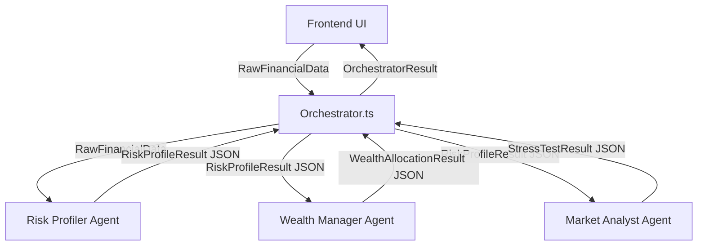

# FinancIQ: Multi-Agent LLM Integration Blueprint

Dokumen ini disusun khusus untuk tim *Backend/AI Engineer* yang akan melanjutkan integrasi *website* FinancIQ ke dalam ekosistem LLM (OpenAI, Anthropic Gemini, atau sistem lokal lainnya).

Arsitektur aplikasi (*Frontend*) sudah di-refactor menggunakan pola **Clean Architecture** melalui *Service Layer*. Dengan kata lain, logika UI telah sepenuhnya terpisah dari logika bisnis AI. Anda tidak perlu menyentuh atau membongkar kode React/UI sama sekali untuk memasukkan koneksi LLM Anda!

## 1. Topologi Arsitektur (Agent Workflow)

Sistem telah dikondisikan agar mengeksekusi tiga (3) agen secara berurutan dalam format *Chain-of-Thought*. 

### Penjelasan Flow:
1. User menekan tombol "Inisiasi Pipeline" di halaman Beranda.
2. `Orchestrator.ts` dipanggil dan melempar *raw input* ke **Risk Profiler Agent**.
3. *Risk Profiler* menghitung rasio dasar dan memperbaiki bias pengguna (misal dari Agresif diubah menjadi Konservatif karena tidak punya kas darurat).
4. Hasil JSON *Risk Profiler* (konteks baru) dilempar ke **Wealth Manager Agent** (untuk alokasi dan *compounding*) dan **Market Analyst Agent** (untuk *stress testing* market crash).
5. Semua hasil (Result) dikemas dalam satu objek besar dan dikembalikan ke UI untuk di-*render*.

---

## 2. Di Mana Anda Harus Menulis Kode (Integrasi API)?

Semua persiapan LLM (Mock Logic) telah dipusatkan pada satu *folder* saja, yaitu:
`frontend/src/services/agents/`

Tugas Anda hanya perlu membuka ketiga *file* agen berikut dan mengubah isi *mock logic*-nya menjadi fungsi `fetch` ke API LLM pilihan Anda.

### A. `RiskProfilerAgent.ts`
- **Goal:** Membaca profil mentah dan memperbaiki persepsi risiko (Misal LLM memarahi *user* yang ingin main kripto tapi gajinya habis untuk bayar cicilan).
- **Prompting Plan:** Berikan *System Prompt*: *"You are an Actuary & Risk Profiler. Read this user's data..."*.
- **Expected Output:** Minta LLM mem-parsing jawaban ke dalam struktur JSON yang sudah didefinisikan pada tipe `RiskProfileResult` (lihat `types.ts`). 

### B. `WealthManagerAgent.ts`
- **Goal:** Membagikan sisa uang (*surplus*) ke berbagai instrumen (RDPU, SBN, Index, Kripto) berdasarkan *output* dari Agent 1.
- **Prompting Plan:** Lempar hasil JSON dari Agent 1 ke dalam *prompt* Agent 2. 
- **Expected Output:** Minta LLM mengembalikan JSON alokasi persentase (*allocations*) yang sesuai tipe `WealthAllocationResult`.

### C. `MarketAnalystAgent.ts`
- **Goal:** Menjalankan skenario *Stress Test* (Resesi, Hiperinflasi, PHK).
- **Prompting Plan:** Lempar hasil JSON dari Agent 1 ke dalam *prompt* Agent 3. Mintalah LLM berimajinasi mengenai probabilitas kehancuran jika krisis terjadi hari ini.
- **Expected Output:** Minta LLM untuk mengisi parameter *string* (`marketCrashImpact`, `hyperinflationImpact`) dalam bentuk JSON sesuai tipe `StressTestResult`.

---

## 3. Struktur Tipe (Schema) Wajib
Harap pastikan LLM di-set menggunakan mode `response_format: { type: "json_object" }` (jika menggunakan OpenAI) dan patuhi *Schema* yang telah kami buat di `types.ts`. 

Jika LLM gagal mengembalikan *field* persis seperti tipe (contoh `dtiRatio` ter-return sebagai *string* padahal *number*), UI (Next.js) akan mengalami *error render*. Selalu *casting* dan berikan *fallback* (contoh: `Number(json.dtiRatio) || 0`) setelah menerima respon LLM sebelum di-*return* dari fungsi `Agent.ts`.

Selamat bereksperimen! Arsitektur ini dirancang sefleksibel mungkin untuk evolusi *multi-agent* tingkat lanjut.
